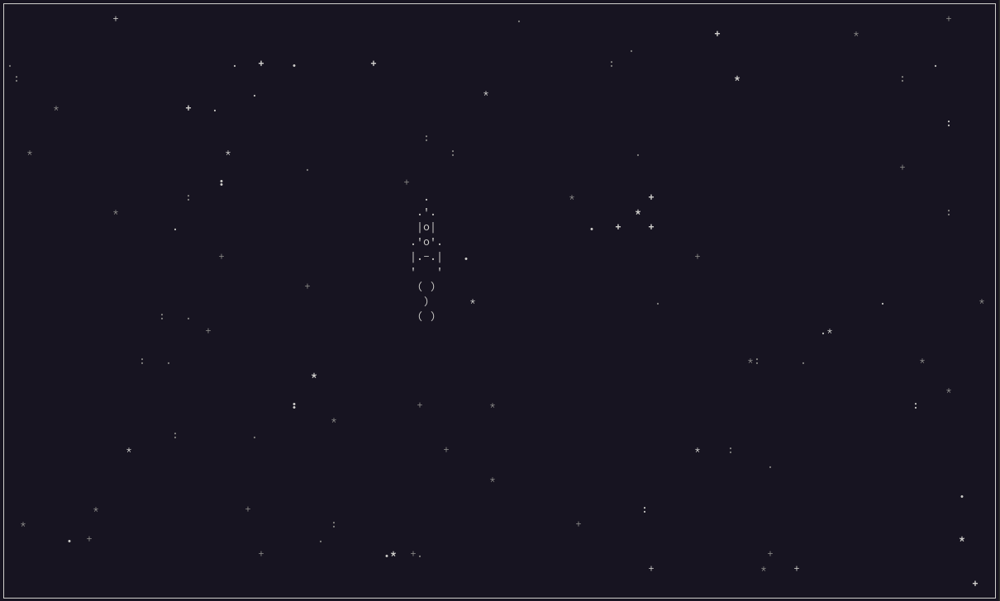

# Игра ракета (Rocket game)

## Требовании 
* ОС Linux - любой 
* Python 3.9(может работь и на других версиях, но проект разрабатывался на 3.9)
## Запуск
### 1. Загрузка на локальное устройство 
```shell
git clone https://github.com/ZiganshinIB/rocket_game
cd rocket_game
```
### 2. Создание витруального окружение
```shell
python -m venv .venv
```
#### 2.1 Активация витруального окружение
```shell
source .venv/bin/activate
```
### 3. Запуск проекта
```shell
python main.py
```
